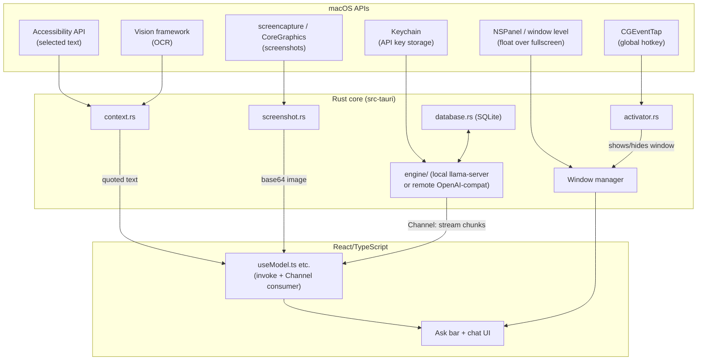
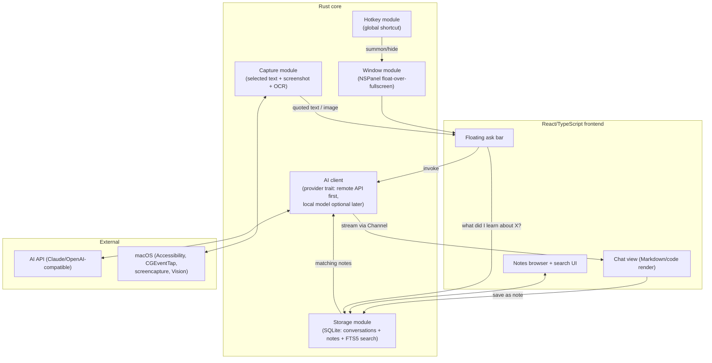

# Thuki Deep-Dive & Our Own App: Analysis + Roadmap

Research basis: a fresh `git clone` of [quiet-node/thuki](https://github.com/quiet-node/thuki) into a scratch directory (read-only, not committed anywhere), the full README, and a direct trace through `src-tauri/*.rs` and `src/*`. This is analysis for learning, not a spec to copy line-for-line.

> **Honesty note on the README videos**: I could not literally watch frame-by-frame footage. Thuki's 5 demo clips are `<video>` tags pointing at `https://github.com/user-attachments/assets/<uuid>` — GitHub's video CDN returns a real, platform-level 404 to *any* unauthenticated request (confirmed with `curl`, browser User-Agent, Referer header, Range header, and `yt-dlp`; identical 404 every time, with GitHub's own headers — this isn't a broken link, it's that the asset host requires an authenticated browser session to resolve). So what's below for each video is reconstructed from the README's own caption plus the matching written spec in `docs/commands.md` / `docs/built-in-web-search.md` in the same repo — clearly labeled as doc-derived, not observed. One static screenshot (`docs/assets/slash-commands-v2.png`) *was* actually opened and read.

---

## 1. What Thuki Is

Thuki ("secretary" in Vietnamese) is a free, open-source, **macOS-only** floating AI overlay. You double-tap the Control key from *anywhere* — even inside a fullscreen app — and a small "ask bar" appears on top of everything. It runs fully local by default: it bundles its own `llama.cpp` inference engine, so there's no cloud call, no API key, no account, and no telemetry required to use it. Conversations live in a local SQLite file. It's Apache-2.0 licensed, built by Logan Nguyen, and per the README is now in "maintenance mode" (stable, gets fixes, no new features from the maintainer). Two community Windows ports exist precisely because the real thing only runs on macOS (13.4+, Apple Silicon only — no Intel).

## 2. What the README's Videos Demonstrate (doc-reconstructed)

| # | Caption | What it shows (per docs/commands.md + docs/built-in-web-search.md) |
|---|---|---|
| 1 | "Always one keystroke away" | Double-tap Control from any app, including a fullscreen one, pops the floating ask bar with no click and no app switch. |
| 2 | "Highlight, then ask" | Whatever text you have highlighted on screen is auto-quoted into the ask bar the instant you summon Thuki — no copy-paste. If you also type something, the typed text is treated as an instruction layered on top of the quote (highlighted text always wins as the "subject"). |
| 3 | "Capture your screen" (`/screen`) | Typing `/screen` takes a screenshot at the moment you hit send (excluding Thuki's own window), attaches it inline like a pasted image, and sends it to a vision-capable model as context. |
| 4 | "Built-in web search" (`/search`) | `/search` forces a live, keyless lookup through Thuki's own pipeline — decide → query → fetch/extract → rank → write — and answers with inline citations and a Sources footer. |
| 5 | "On-device model library" | An in-app browser lets you search Hugging Face for GGUF models (Llama, Gemma, Qwen, etc.), download one, and switch the active model right from the ask bar. |

The one screenshot I did open (`docs/assets/slash-commands-v2.png`) is essentially the whole command surface on one card: `/translate`, `/tldr`, `/rewrite`, `/screen`, `/extract` (OCR), `/search`, `/think`, `/explain`, plus `/bullets /todos /refine` — confirming the README's pitch that "Thuki is a key you press," not a menu you navigate.

## 3. How Thuki Actually Works — Traced in Code

This is the important part. Thuki is **not** a thin "call an API" wrapper — it's ~43k lines of Rust, and it needed to drop below Tauri's own APIs for its two headline tricks.

### Floating window that survives fullscreen apps — the core trick
A plain Tauri window's "always on top" (`tauri.conf.json` even sets `alwaysOnTop: false` — it's deliberately unused) **cannot** float over a native macOS fullscreen app or a different Space. Thuki solves this by converting its Tauri window into a real **NSPanel** using the third-party `tauri-nspanel` crate, then setting things Tauri's own API has no knob for:
- `panel.set_level(PanelLevel::Floating.value())` — a real AppKit window level.
- `CollectionBehavior::new().full_screen_auxiliary().can_join_all_spaces()` — this is the actual mechanism that lets it sit above a fullscreen app/other Spaces; plain always-on-top physically cannot do this.
- `StyleMask::empty().nonactivating_panel()` — so appearing doesn't steal focus from the fullscreen app underneath.
- `panel.set_has_shadow(false)` — the native shadow flickered between key/non-key states, so it's disabled and replaced with a CSS box-shadow in the frontend.
There's also raw `objc2` `msg_send!` calls to force a clear background color, mark the window non-opaque, and clip the content view to a rounded rect — cosmetic bugs that the panel conversion itself introduced.

**Simple English:** Tauri gives you a window. macOS has a separate, older concept ("panels") that behaves differently around fullscreen Spaces and focus-stealing. Thuki reaches past Tauri, straight into that older AppKit API, because Tauri never wrapped it.

### Global shortcut — not a plugin, a raw low-level hook
There's no `tauri-plugin-global-shortcut`. `activator.rs` opens a raw macOS **`CGEventTap`** at the lowest level (`HID`) — the same technique apps like Karabiner-Elements use — and watches only `FlagsChanged` events on the Control key. A small hand-written state machine detects **two Control taps within 400ms**, with a 600ms cooldown so it doesn't double-fire. This needs Accessibility permission (`AXIsProcessTrusted`) and runs on its own thread with its own event loop, with retry logic for when macOS auto-disables the tap or permission isn't granted yet.

**Simple English:** instead of asking the OS "tell me when Cmd+Shift+Space is pressed" (what a global-shortcut plugin does), Thuki watches *every* keyboard event system-wide and does its own pattern-matching for "was Control tapped twice quickly." More power, more responsibility (it must handle permissions and OS timeouts itself).

### Selected-text capture — two tiers
1. **Primary:** the macOS Accessibility API — ask the system-wide focused UI element directly for its `kAXSelectedText` attribute. No clipboard touched, works in any app that plays nicely with Accessibility.
2. **Fallback** (for apps that don't expose that attribute): save whatever's currently on the clipboard, clear it, synthesize a Cmd+C keypress at the OS event level, poll the clipboard until it changes, read the new value, then put the original clipboard content back.

### Screenshots — reuses the OS's own tools, no custom capture UI
- Interactive capture: hides its own window, then just shells out to `screencapture -i -x <path>` — the exact CLI tool behind Cmd+Shift+4.
- Silent full-screen capture: CoreGraphics `CGWindowListCreateImageFromArray`, explicitly excluding its own window by PID.

### AI request flow — local engine + one shared streaming contract
Two provider types share one interface: a **bundled local path** (spawns a `llama-server` subprocess — bundled as a Tauri "external binary" — running a GGUF model file the user downloaded through an in-app Hugging Face-style model manager), and a **remote path** (any OpenAI-compatible `/v1/chat/completions` endpoint, API key stored in the macOS Keychain, never a plaintext file). Both stream via SSE into one shared Rust enum (`Token`, `ThinkingToken`, `Done`, `Error`, ...), delivered to the frontend over a **Tauri `Channel`** — a lighter-weight, per-call binary IPC lane in Tauri v2, distinct from its pub/sub `emit`/`listen` events (which Thuki reserves for one-off signals like "model finished warming up").

### Conversation storage — plain SQLite, hand-rolled migrations
`rusqlite` (bundled, so no system SQLite dependency) writing to a `.db` file in the app's data directory. Two core tables — `conversations` and `messages` (foreign key, cascade delete) — plus config/model tables in the same file. Schema changes are applied with a small idempotent "add this column if it's missing" helper rather than a migration framework.

### Frontend ↔ Rust
Standard Tauri `invoke()` calls from React — 40+ distinct commands (`ask_model`, `capture_screenshot_command`, `persist_message`, etc.), each a `#[tauri::command]` async function. Anything long-running or streaming (chat, model downloads) passes a `Channel` argument so Rust can push incremental updates back on the same call; one-off notifications use global events instead.

### macOS-specific extras
- `ActivationPolicy::Accessory` — no Dock icon, pure menu-bar-style app (switches to `Regular` only while its Settings window is open, so that window can take normal focus).
- A tray icon.
- OCR via Apple's own **Vision framework** (`objc2-vision`, `VNRecognizeTextRequest`) — not Tesseract, not a Rust OCR crate.
- Helper functions that deep-link straight into System Settings' Accessibility/Screen Recording panes.

### Tauri vs. Rust vs. React — who does what

| Layer | Responsible for | Concrete example |
|---|---|---|
| **Tauri** (framework) | Window/webview creation, app bundling, auto-updater, IPC transport (`invoke`, `Channel`, events), tray API, activation-policy enum | `tauri::tray::TrayIconBuilder`, `tauri::ipc::Channel` |
| **Custom Rust** (native, hand-written) | NSPanel conversion + raw AppKit calls, `CGEventTap` hotkey, Accessibility text capture, `screencapture`/CoreGraphics, local-model subprocess management, SQLite, Keychain, Vision OCR | `activator.rs`, `context.rs`, `engine/*.rs` |
| **React/TypeScript** | UI rendering, chat state, calling `invoke`, consuming `Channel` stream chunks, Settings screens, Markdown rendering | `src/hooks/useModel.ts`, `src/App.tsx` |

**The single most important takeaway:** Tauri, by itself, could not deliver either headline feature (floating over fullscreen apps, or the system-wide double-tap hotkey). Both required going around Tauri into raw AppKit (`objc2`, a third-party NSPanel crate) and CoreGraphics. Anyone building something similar needs to plan for that from day one, not treat it as a later polish step.



---

## 4. Our App: What We're Actually Building

Same shape as Thuki's V1 request in the original brief — small floating window → ask anything → AI answers, always available without opening a big app — but we deliberately add a **notes + personal knowledge base** layer (V3/V4), which is the part that makes it ours rather than a Thuki re-skin.

### Architecture (target, once all 4 versions are built)



### Tech stack recommendation

- **Framework:** Tauri v2 — same reasoning as Thuki: it's the only realistic way to get a small, native-feeling, cross-platform-capable floating window with a Rust backend and a web-tech frontend, and it's exactly the "Rust ↔ TypeScript" learning surface you asked for.
- **Frontend:** React + TypeScript + Vite (Tauri's default template) + a Markdown/code renderer (`react-markdown` + `shiki` or `rehype-highlight` for syntax highlighting).
- **AI provider:** start with a **remote API** (Claude API or any OpenAI-compatible endpoint) behind a small Rust trait (`AiProvider`), not a bundled local model. Bundling `llama.cpp` like Thuki does is a legitimate advanced stretch goal later, but it's a large, separate skill (process supervision, model downloads, GGUF handling) that would slow down the core learning path. Design the trait so a local provider can be added later without touching the rest of the app.
- **Storage:** SQLite via `rusqlite` with the `bundled` feature (no system SQLite needed), same as Thuki. Use SQLite's built-in **FTS5** extension for notes search in V4 — it's plain SQL, ships with SQLite, and is the right amount of complexity before reaching for embeddings/vector search.
- **Global hotkey:** start with the `tauri-plugin-global-shortcut` plugin for V1 (much simpler, cross-platform) — a raw `CGEventTap` double-tap detector like Thuki's is a great *macOS-specific deep dive* to do once V1 already works, not a blocker to get something running.
- **Floating/always-on-top window:** start with Tauri's built-in `alwaysOnTop` for V1's basic floating window (good enough for normal desktop use). Graduate to the `tauri-nspanel` + AppKit-level trick only when you specifically want "floats over fullscreen apps too" — that's a deliberate, named phase (see roadmap), not something to bolt on halfway through.
- **Selected text:** macOS Accessibility API (`AXUIElementCreateSystemWide`) with the clipboard-simulated-Cmd+C fallback, same two-tier pattern as Thuki — this is real, transferable macOS API knowledge.
- **Screenshots:** shell out to `screencapture -i` for interactive capture (V2) — don't build a custom region-selector; the OS tool is simpler and it's exactly what Thuki does.
- **OCR (for "understand code from screenshot"):** Apple's Vision framework via `objc2-vision`, same as Thuki — free, local, native, and a good introduction to calling Apple frameworks from Rust.

### Where V1–V4 map onto the roadmap phases

- **V1** (floating window, hotkey, ask AI, streaming, history, Markdown) → Phases 1–5
- **V2** (selected text, screenshot, code understanding) → Phases 6, 7, 9
- **V3** (notes) → Phase 8
- **V4** (learning/knowledge-base search) → Phase 10

---

## 5. Roadmap

Each phase: what we build → what we learn → what it looks like when done.

**Phase 1 — Basic Tauri app**
- *Build:* Scaffold a Tauri + React + TS app. One button in the UI calls one Rust command (`invoke("ping")`) and shows the result.
- *Learn:* Rust fundamentals (structs, `Result`, `?`), Cargo, the Tauri command macro, the dev/build loop.
- *Result:* A normal window app where clicking a button proves Rust and React are talking.

**Phase 2 — Floating window**
- *Build:* Configure the window as small, borderless, transparent, and always-on-top via `tauri.conf.json` + the window API.
- *Learn:* Tauri window configuration, window labels, basic ownership/borrowing as you pass window handles around.
- *Result:* A small pill-shaped window that floats over other normal (non-fullscreen) apps.

**Phase 3 — Global shortcut**
- *Build:* Wire up `tauri-plugin-global-shortcut` so a key combo shows/hides the floating window from anywhere.
- *Learn:* Tauri plugins, event handlers, enums for app state (shown/hidden).
- *Result:* Press a hotkey from any app, the ask bar appears; press again (or Esc), it hides.

**Phase 4 — AI integration**
- *Build:* A Rust `AiProvider` trait, one implementation that calls a remote chat-completions API, wired to a "send" button in the UI.
- *Learn:* Traits, async Rust basics, an HTTP client crate (`reqwest`), JSON (`serde`), error handling with `Result`/custom error enums.
- *Result:* Type a question, get a full (non-streamed) answer back in the UI.

**Phase 5 — Streaming responses + history + Markdown**
- *Build:* Switch the API call to streaming (SSE), pipe chunks to the frontend over a Tauri `Channel`, render answers with a Markdown/code renderer, keep an in-memory conversation list.
- *Learn:* Tokio/async streams, Tauri `Channel` vs events, more serde, basic React state management.
- *Result:* Answers appear token-by-token, code blocks render with syntax highlighting, you can scroll back through the current session's messages.

**Phase 6 — Selected text**
- *Build:* A Rust module that reads the macOS Accessibility API for the current selection, with a clipboard-based fallback; wire it so summoning the app quotes the current selection.
- *Learn:* Calling native macOS frameworks from Rust (`objc2`/`core-foundation` crates), permission prompts, fallback design.
- *Result:* Highlight text anywhere, hit the hotkey, it's already quoted in the ask bar.

**Phase 7 — Screenshot**
- *Build:* A command that hides the window, shells out to `screencapture -i`, reads the resulting PNG, sends it to the frontend as base64, attaches it to a message.
- *Learn:* Spawning subprocesses from Rust, temp files, base64 encoding, image handling in the frontend.
- *Result:* A `/screen`-style command that captures a region and sends it to a vision-capable model as context.

**Phase 8 — SQLite + Notes**
- *Build:* Add `rusqlite`, a `conversations`/`messages` schema, and a `notes` table (title, Markdown content, selected text, screenshot path, source URL, tags, timestamp). Add a "Save as Note" action in the chat UI.
- *Learn:* SQL schema design, `rusqlite` query patterns, simple migrations, structuring a Rust module around a database.
- *Result:* Conversations persist across restarts; any AI answer can be saved as a structured note.

**Phase 9 — Code understanding**
- *Build:* Add OCR (Apple Vision framework) so screenshots of code/text become extractable text; add a "explain this code" prompt template that combines selected text/screenshot + OCR output.
- *Learn:* Calling Vision from Rust, prompt templating, composing existing modules (capture + OCR + AI) into one feature.
- *Result:* Screenshot a code snippet from any app, ask "explain this simply," get a plain-English explanation you can save as a note.

**Phase 10 — Search + personal knowledge base**
- *Build:* Add SQLite FTS5 full-text search over notes, a tags system, a "related notes" lookup, and a top-level "what did I learn about X?" flow that searches notes and feeds matches to the AI as context.
- *Learn:* FTS5 syntax, retrieval-then-generate pattern (a simple form of RAG), UI for search/filter by tag.
- *Result:* Ask "what did I learn about Rust ownership?" and get an answer grounded in your own saved notes, with links back to the source notes.

**Phase 11 — Polish + packaging**
- *Build:* App icon, tray icon, proper Settings screen (API key storage via Keychain, not plaintext), signed/notarized build if you want to distribute it, basic tests for the Rust core.
- *Learn:* `tauri-plugin-updater`/bundling config, Keychain access via the `keyring` crate, Rust testing (`#[test]`, `cargo test`), packaging for distribution.
- *Result:* A real, installable `.app` you'd actually keep on your own machine.

---

## 6. Recommended Project Folder Structure

```text
your-app/
├── src/                        # React/TypeScript frontend
│   ├── components/
│   │   ├── AskBar.tsx
│   │   ├── ChatView.tsx
│   │   └── NotesBrowser.tsx
│   ├── hooks/
│   │   ├── useAi.ts             # invoke() calls + Channel stream consumer
│   │   └── useNotes.ts
│   ├── lib/
│   │   └── markdown.ts          # renderer setup
│   └── App.tsx
├── src-tauri/
│   ├── src/
│   │   ├── main.rs / lib.rs
│   │   ├── window.rs            # floating window setup (Phase 2, later NSPanel)
│   │   ├── hotkey.rs            # global shortcut (Phase 3)
│   │   ├── capture/
│   │   │   ├── selected_text.rs # Phase 6
│   │   │   ├── screenshot.rs    # Phase 7
│   │   │   └── ocr.rs           # Phase 9
│   │   ├── ai/
│   │   │   ├── provider.rs      # AiProvider trait
│   │   │   ├── remote.rs        # OpenAI-compatible/Claude client
│   │   │   └── stream.rs        # StreamChunk enum, Channel plumbing
│   │   ├── db/
│   │   │   ├── mod.rs
│   │   │   ├── schema.rs
│   │   │   ├── conversations.rs
│   │   │   └── notes.rs         # + FTS5 search (Phase 10)
│   │   └── commands.rs          # #[tauri::command] handlers, grouped by domain
│   ├── capabilities/
│   ├── tauri.conf.json
│   └── Cargo.toml
├── docs/
│   └── (design notes as you go — one topic per file, this repo's own convention)
└── package.json
```

## 7. What to Build First

**Phase 1, literally today:** `bun create tauri-app`, pick React + TypeScript, get it running with `bun run tauri dev`, then add exactly one Rust command (`#[tauri::command] fn ping() -> String`) called from a button in the UI. Don't touch window styling, hotkeys, or AI yet — the goal of Phase 1 is only to prove the Rust ↔ TypeScript round-trip works on your machine before layering anything else on top of it.
